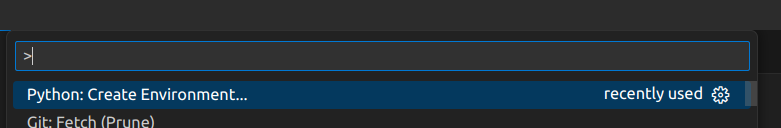
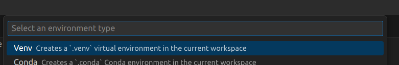
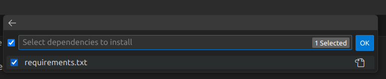
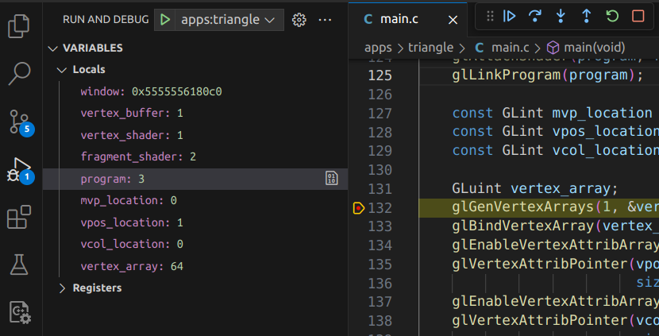

# Builderer Examples
This repository contains some example usage of [Builderer](https://github.com/builderer/builderer).

# Instructions
## Prerequisites
* Git (required to fetch dependencies)
* Python version >= 3.9 (required for generating build files)
* VSCode (optional, but strongly recommended)
* Windows
  * Visual Studio 2022 with "Desktop development with C++"
* Mac
  * XCode Command-line Tools: `xcode-select --install`
* Linux
  * C/C++ toolchain: `build-essential`, `g++-multilib`
  * GLFW requires: `libx11-dev`, `libxcursor-dev`, `libxinerama-dev`, `libxi-dev`

## VSCode
VSCode provides a seamless development solution for Windows, Mac and Linux that
works well with Builderer workflow. As such taken care to ensure usage
instructions are the same regardless of platform when using VSCode.
### Create Python Virtual Environment
Ideally VSCode could pre-configure these steps, but until it does, here are the
quick steps for configuring a Python Environment...

#### Open the Command-Palette (Ctrl-Shift-P or Cmd-Shift-P) and select "Python: Create Environment"

#### Select "Venv" as the environment type

#### Select a Python version >= 3.9 as your interpreter

#### Select "requirements.txt" for what dependencies to install

### Build / Run / Debug
You can now select your launch target in the "Run and Debug" panel to build and run! 
