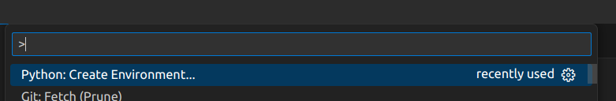
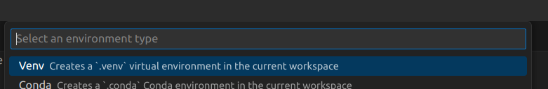
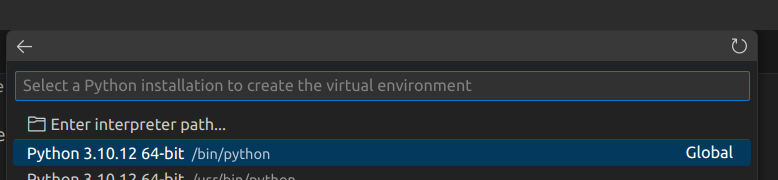
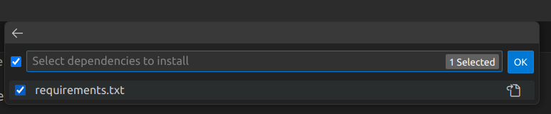
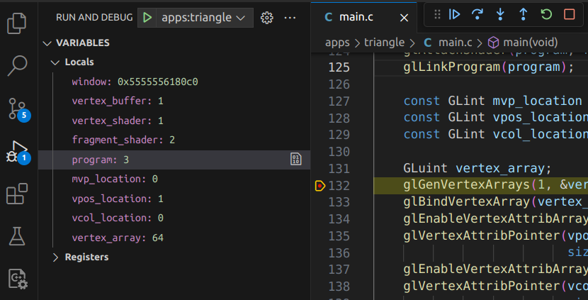

# VSCode Instructions
VSCode provides a consistent development solution for Windows, Mac and Linux
that works well with Builderer workflow. As such care has been taken to ensure
usage instructions are the same regardless of platform when using VSCode.
## Create Python Virtual Environment
Ideally VSCode could pre-configure these steps, but until it does, here are the
quick steps for configuring a Python Environment...

### 1) Open the Command-Palette (Ctrl-Shift-P or Cmd-Shift-P) and select "Python: Create Environment"

### 2) Select "Venv" as the environment type

### 3) Select a Python version >= 3.9 as your interpreter

### 4) Select "requirements.txt" for what dependencies to install

### 5) Build / Run / Debug
You can now select your launch target in the "Run and Debug" panel (or simply press F5) to build, run and debug! 
